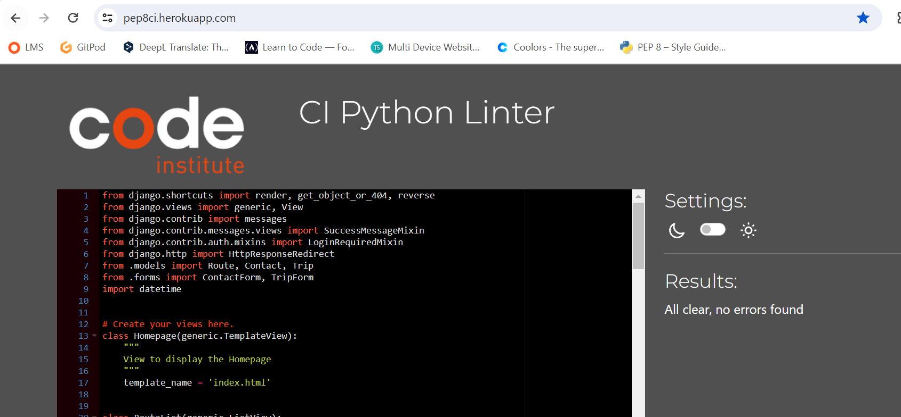

# EuroBike

Welcome to EuroBike!

EuroBike is a bike planning app designed to help bikers to travel long distance across Europe. The function of the app is twofold: provide biking routes across multiple European States and remove the hassle of what to pack for a long trip. It is targeted towards bikers of all levels (basic, intermediate, pro) offering different packing solutions for each of them. 
The site acts as a repository for trips where users can store all the data for the organisation of their next trips.

The live link of our site can be found here - [EuroBike](https://eu-bike-planner-4c87e2f122b8.herokuapp.com/)

## 

## Table of Contents
- [EuroBike](#eurobike)
  * [User Experience (UX)](#user-experience-ux)

## User Experience (UX)

An user of EuroBike would be someone who is passionate about biking long distance and who likes travelling by bike for multiple days. For such trips, packing smartly to reduce weight and use less space is essential. Or alternatively, packing everything you need could be for some bikers top priority rather than weight. 
On top of that, a visitor of EuroBike can find in the app a map of the chosen route. 

### User Stories

#### As a user I want to:

- log in or log out of my account so that my account is safe
- register an account so that I can add, edit or delete my bike tour plans
- login so that I can access my booked bike tour plans
- view a list of all the bike routes
- view the description and map of each route so that I can choose which route suits me
- select bike routes from a list so that I can plan which route to do
- select among different options for different categories of items to organise what to pack for the trip
- add additional items if anything is missing in the preselected packing options
- view the list of items for the trip so that I can ensure if things need to be added or deleted
- update a list item so that I can adjust accordingly my iventory for the trip
- delete a trip from the my booked trips, if I am not going to do it anymore
- contact Site's Admin so that I can send my questions/ feedback regarding the use of the application

#### As a site administrator I want to:
- allow only registered users to use the website so that they can only access their own bike trip plans
- access the admin panel so that I can check and manage the items of the bike tour plans of each user
- manage the list of bike routes and items so that I can keep up-to-date routes and lists of items
- review messages sent by users so that I can address their requests
- delete read & actioned users messages so that I do not action the same message twice

## Design

The site has a clean and simple design to provide users with easy access to essential information for their trips. 

### Color scheme

The main colors chosen for the website are those of the Europe Union flag. This aims at conveying the fact that the project wants to help bikers travelling across Europe.

The background image of the homepage has different shades of blue, aiming at fitting with the blue color of the header and the footer. Blue is a calming color and the image wants to remind bikers of the calming and freeing sensation of biking, with wind in the hair and the feeling that there are no boundaries when you bike. 

The Gold metallic color of the European Union flag can be found as well in the footer: social media icons turn to Gold when the user hover over them. 

### Imagery

The background image of the homepage display 2 bikers in a beautiful natural landscape. The purpose is to motivate bikers to discover Europe and its immense beauty by slow travelling on their bike. Slow travelling can allow to experience at 360 degrees the new surroundings in which someone cycles.

In the Routes page there is an image for each Route. Different images for each route want to communicate the richness and diversity that exist in Europe, from Stockholm to Rome, from Lisbon to Moscow. 

A map with all the Routes is available in the Homepage. Individual map of each Route can be displayed in the site (for more details about it, check the Features section). 

### Typography

The Font chosen for the site is Montserrat. The font was imported via Google Fonts. The back-up font is sans-serif.

### Wireframes

The wireframes for the "EuroBike" website were created with Figma.

Homepage

Routes

Add Trip

My Trips

Trip Details

Contact

## Agile Methodology 

Github projects was used to manage the development process using an agile approach. Please click [here] (https://github.com/users/aedoardo1990/projects/3) to view the User Stories in the Kanban board.

A Github Issue was created for each User Story. Each User Story has defined acceptance criteria to make it clear when the User Story has been completed. Not all the User Stories were completed exactly as defined when they were first created. However the differences between the conception of the User Stories and the Final Site are documented in the comments of each User Story. 

## Data Model

Principles of Object-Oriented Programming were used throughout this project. 

Django AllAuth was used for the user authentication system.

The main Model of the app is the Trip model. It allows users to add trips. The trip author is a foreign key to the User model given a trip can only have one author.

The following 9 models are linked by a Foreign Key to the Trip Model and they enable the below actions to a site visitor:
- Route -> choose a route from a preselected list 
- Bike -> choose a bike type from a preselected list
- Clothes  -> select clothing equipment from a preselected list
- Repair -> choose a repair kit from a preselected list
- Bags -> select a bag type from a preselected list
- Sleep -> select a sleeping kit from a preselected list
- Electric -> choose a set of electronics from a preselected list
- Toilet -> choose a set of toiletries from a preselected list
- Cook  -> select a cooking kit from a preselected list

The Route model allows as well to display all the routes under the Routes tab and to view the photo, the description and the map of each route. 

On the top of the mentioned models, there is as well a Contact model, which enables the User to send messages to the Admin, and the Admin to view and manages the messages of site visitors. This model can be accessed by a logged out User too. On the contrary, when the User is logged in, the Name and Email fields will be autopopulated with the User's data.

The diagram below is a detailed view of the database schema.

## Testing 

### HTML Validator

The website was validated by URI into the validator. No errors found.

### CSS Validator

No errors found for the CSS validator. There are 6 warnings, code from those lines was taken from the Bootstrap Rosie walkthrough of CI

### PEP 8 Validator

No error found for the PEP8 validator

1- bike_project:
- urls.py

2- bike_planner app
- admin.py - imports from .models have been divided on 2 lines (line 2 and 3 of admin.py) to reduce line 2 to less than 80 digits and to pass PEP validator

- forms.py

- models.py

- views.py

- urls.py

## Features

### Existing Features 

#### Maps
user when clicking on a Route in the Routes page. When an user will create a new trip, the map of the selected route will appear. 

