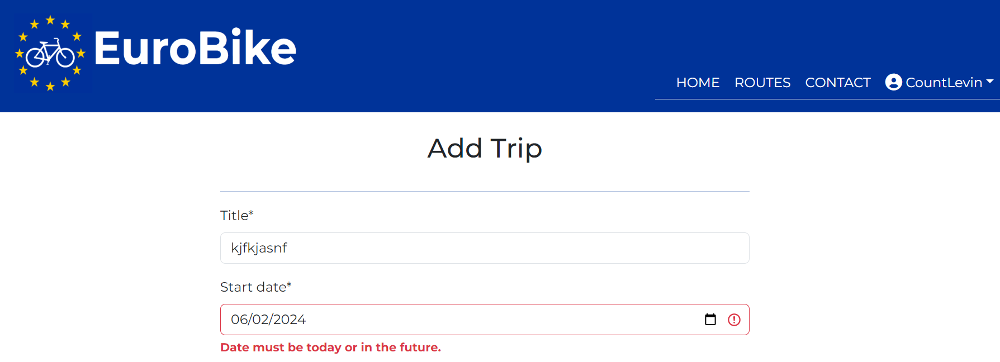
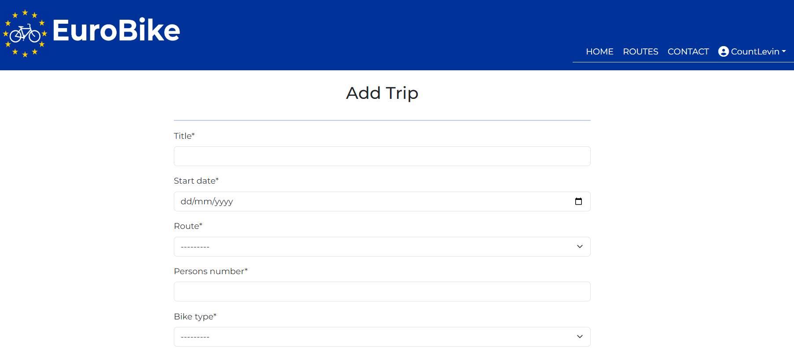

# EuroBike

Welcome to EuroBike!

EuroBike is a bike planning app designed to help bikers to travel long distance across Europe. The function of the app is twofold: provide biking routes across multiple European States and remove the hassle of what to pack for a long trip. It is targeted towards bikers of all levels (basic, intermediate, pro) offering different packing solutions for each of them. 
The site acts as a repository for trips where users can store all the data for the organisation of their next trips.

The live link of our site can be found here - [EuroBike](https://eu-bike-planner-4c87e2f122b8.herokuapp.com/)

## 

## Table of Contents
- [EuroBike](#eurobike)
- [Table of Contents](#table-of-contents)
- [User Experience (UX)](#user-experience-ux)
- [User Stories](#user-stories)
- [Design](#design)
  - [Color scheme](#color-scheme)
  - [Imagery](#imagery)
  - [Fonts](#fonts)
  - [Structure](#structure)
  - [Wireframes](#wireframes)
- [Agile Methodology](#agile-methodology)
- [Data Model](#data-model)
- [Messages and Interaction With Users](#messages-and-interaction-with-users)
- [Admin Panel-Superuser](#admin-panel---superuser)
- [Features](#features)
  - [Existing Features](#existing-features)
  - [Future Features](#future-features)
- [Validation](#validation)
  - [HTML validator](#html-validator)
  - [CSS validator](#css-validator)
  - [PEP8 validator](#pep-8-validator)
  - [JShint validator](#jshint-validator)
- [Testing](#testing)
  - [Manual testing](#manual-testing)
  - [Lighthouse](#lighthouse)
  - [Browser testing](#browser-testing)
  - [Device testing](#device-testing)
  - [Mentor, family and friends testing](#mentor-family-and-friends-testing)
- [Bugs](#bugs)
  - [Fixed bugs](#fixed-bugs)
  - [Unfixed bugs](#unfixed-bugs)
- [Deployment to Heroku](#deployment-to-heroku)
- [Technologies used](#technologies-used)
  - [Languages](#languages)
  - [Frameworks - Libraries - Programs Used](#frameworks---libraries---programs-used)
  - [Django Packages](#django-packages)
  - [Python libraries](#python-libraries)
- [Credits](#credits)
  - [Code used](#code-used)
  - [Media](#media)
- [Acknowledgments](#acknowledgements)

## User Experience (UX)

An user of EuroBike would be someone who is passionate about biking long distance and who likes travelling by bike for multiple days. For such trips, packing smartly to reduce weight and use less space is essential. Or alternatively, packing everything you need could be for some bikers top priority rather than weight. 
On top of that, a visitor of EuroBike can find in the app a map of the chosen route. 

### User Stories

#### As a user I want to:

- log in or log out of my account so that my account is safe
- register an account so that I can create a new bike trip
- login so that I can access my booked bike tour plans
- view a list of all the bike routes
- view the description and map of each route so that I can choose which route suits me
- select bike routes from a list so that I can plan which route to do
- select among different options for different categories of items to organise what to pack for the trip
- add additional items if anything is missing in the preselected packing options
- view the list of items for the trip so that I can ensure if things need to be added or deleted
- update a list item so that I can adjust accordingly my iventory for the trip
- delete a trip from the my booked trips, if I am not going to do it anymore
- contact Site's Admin so that I can send my questions/ feedback regarding the use of the application

#### As a site administrator I want to:
- allow only registered users to use the website so that they can only access their own bike trip plans
- access the admin panel so that I can check and manage the items of the bike tour plans of each user
- manage the list of bike routes and items so that I can keep up-to-date routes and lists of items
- review messages sent by users so that I can address their requests
- delete read & actioned users messages so that I do not action the same message twice

## Design

The site has a clean and simple design to provide users with easy access to essential information for their trips. 

### Color scheme

The main colors chosen for the website are those of the Europe Union flag. This aims at conveying the fact that the project wants to help bikers travelling across Europe.

The background image of the homepage has different shades of blue, aiming at fitting with the blue color of the header and the footer. Blue is a calming color and the image wants to remind bikers of the calming and freeing sensation of biking, with wind in the hair and the feeling that there are no boundaries when you bike. 

The Gold metallic color of the European Union flag can be found as well in the footer: social media icons turn to Gold when the user hovers over them. 

### Imagery

The background image of the homepage display 2 bikers in a beautiful natural landscape. The purpose is to motivate bikers to discover Europe and its immense beauty by slow travelling on their bike. Slow travelling can allow to experience at 360 degrees the new surroundings in which someone cycles.

In the Routes page there is an image for each Route. Different images for each route want to communicate the richness and diversity that exist in Europe, from Stockholm to Rome, from Lisbon to Moscow. 

A map with all the Routes is available in the Homepage. Individual map of each Route can be displayed in the site (for more details about it, check the Features section). 

### Fonts

The Font chosen for the site is Montserrat. The font was imported via Google Fonts. The back-up font is sans-serif.

### Structure

The project consists of one Django application - named bike_planner. The website has the following pages and each page the corresponding functions:

- index.html -> home page containing essential info about the website
- add-trip.html -> to create a trip by choosing route and selecting which items to pack 
- trip-details.html -> when the trip is booked, the user is redirected to this page, where all the booked info are visible + a map of the selected route
- my-trips.html -> each logged in user can check here his/her booked trips
- edit-trip.html -> to edit the details of a booked trip
- delete-trip.html -> to delete a booked trip from my-trips.html
- routes.html -> to view a list of all the routes. This page is accessible both from logged in and logged out users. 
- route_details.html -> to check the details of each route (photo, description and map). This page can be viewed both from logged in and logged out users. 
- contact.html -> to allow the user to send messages about the site to Admin. This page can be displayed both from logged in and logged out users. 
- contact-received.html -> when the contact form is sent, this page is displayed

There are also a few customised pages related to user's authentication option with Alluath:

- login.html
- logout.html
- signup.html

### Wireframes

The wireframes for the "EuroBike" website were created with Figma.

Homepage

Routes

Add Trip

My Trips

Trip Details

Contact

## Agile Methodology 

Github projects was used to manage the development process using an agile approach. Please click <a href=" https://github.com/users/aedoardo1990/projects/3" alt="link to Kanban Board"> here</a> to view the User Stories in the Kanban board.

A Github Issue was created for each User Story. Each User Story has defined acceptance criteria to make it clear when the User Story has been completed. Not all the User Stories were completed exactly as defined when they were first created. However the differences between the conception of the User Stories and the Final Site are documented in the comments of each User Story. 

## Data Model

Principles of Object-Oriented Programming were used throughout this project. 

Django AllAuth was used for the user authentication system.

The main Model of the app is the Trip model. It allows users to add trips. The trip author is a foreign key to the User model given a trip can only have one author.

The following 9 models are linked by a Foreign Key to the Trip Model and they enable the below actions to a site visitor:
- Route -> choose a route from a preselected list 
- Bike -> choose a bike type from a preselected list
- Clothes  -> select clothing equipment from a preselected list
- Repair -> choose a repair kit from a preselected list
- Bags -> select a bag type from a preselected list
- Sleep -> select a sleeping kit from a preselected list
- Electric -> choose a set of electronics from a preselected list
- Toilet -> choose a set of toiletries from a preselected list
- Cook  -> select a cooking kit from a preselected list

The Route model allows as well to display all the routes under the Routes tab and to view the photo, the description and the map of each route. 

On the top of the mentioned models, there is as well a Contact model, which enables the User to send messages to the Admin, and the Admin to view and manages the messages of site visitors. This model can be accessed by a logged out User too. On the contrary, when the User is logged in, the Name and Email fields will be autopopulated with the User's data.

The diagram below is a detailed view of the database schema.

## Messages and interaction with users 

    
Messages updating the user when an action has been completed.

- Login successful

- Trip created

- Date can not be in the past

- Trip edited

- Trip deleted

- Contact form sent

- Logout successful 

## Admin Panel - Superuser 

In the Admin Panel the Admin/ Superuser has full access to CRUD functionality to create, edit or delete users' trips and the available packing options in the website regarding the following items: bags, bike types, clothes, cooking kit, electronics, toiletries, repair kit, routes, sleeping kit. 
In the Admin Panel the Superuser can as well address messages sent by site visitors via the contact form.

## Features

### Existing Features 

Wesbite name and logo

They are included on all pages. They are a clickable link to Home page which is a common feature on many websites. The logo was taken from the wikipedia page of EuroVelo - [Wikipedia EuroVelo](https://en.wikipedia.org/wiki/EuroVelo)

Navbar and Call to Action Intro Message

- Navbar - Logged out User

When the user is logged out, the navbar contains the links to Home, Routes, Contact Form, SignUp and Login. Below the header there is a Call to Action message inviting visitors of the site to register or, if they have already an account, to login. 

- Navbar - Logged in User

When the user is logged in, the navbar includes the links to Home, Routes, Contact Form, and Username. When the User clicks on the Username tab, a dropdown will appear with 3 options: Add Trip (to create a new trip), My Trips (this allows the user to view the booked trips), Logout. 
Below the header the Call to Action message will invite the logged in user to create a new trip. 

Register

It is located on signup.html. It was taken from Allauth and then customised. It enables the user to register an account using own username and password with an optional input of user's email address.
If the user already created an account, there is a link in the page to redirect to the login page. 

Login

It is located on login.html. It was taken from Allauth and then customised. It enables the user to login to the already created account by giving the username and password with an option to remember the username.

Introduction to the Website

Below the background image of the homepage, there is a brief introduction to how the website help bikers to travel across Europe. A section called "Routes Map" follows to introduce the user to the biking routes and to the project of EuroVelo. 

Footer

It contains icons with links to Youtube, X-Twitter, Pinterest and the Github profile of the author of the site. When 

Add Trip

It is located on add-trip.html. It contains the form allowing the user to create a new trip with all the requested details. Most of the fields offer the user with a choice from a dropdown list. In the fields of Title and Additional Items, the user can type in anything, in the field of Persons number only numbers can be entered, and in the Date Field only a date.

View Trip Details and Route Map 

When a trip is booked, the user is redirected to this newly created page with all the data entered by the user for the trip + the map of the selected route.  

The user can choose to edit one or more of the fields by pressing the Edit button at the bottom, or to go to the Delete page to cancel the trip by pressing the Delete button. 

My Trips Page

It is located on my-trips.html. This feature allows the user to view all her/his booked trips. 

Edit Trip

It is located on edit-trip.html. It enables the user to modify any of the details of a booked trip. 

Delete Trip

It is located on delete-trip.html. It enables the user to delete a booked trip. Alternatively, the user can press the other button "Back to my trips".

Routes Page

It is located on routes.html. This page allows logged in and logged out users to check a list of all the available bike routes. The introducing card of each route includes an image of the route, the title and an excerpt of the route description. 

View Routes Details

When a User clicks on one of the routes in routes.html, she/he is redirected to a more detailed page of the route. This page will include name, photo, description and map of the route.

Contact form

Logged in and logged out users can contact the Admin of the Site by sending a form via this page. It is located on contact.html.

When the form has been sent successfully, a confirmation message a video of a biking person in a forest will be displayed.

### Future Features 

Integration of Google Maps

In the future we would like to replace current maps with interactive Google Maps, that the biker could use to navigate on the route with her/his mobile device and GPS. This functionality will look similar to that of EuroVelo - for an example click <a href="https://en.eurovelo.com/ev1">here</a>. It will have a more interactive and a cleaner style than the version of EuroVelo.

Meeting other bikers 

We would like to include an option to meet bikers travelling on the same route or in the surroundings. This would allow Users to create a EuroBike community aiming at biking together and sharing the experience provided by EuroBike. This feature could be implemented with a Chat function to be included in the app. 

Integration of booking.com/AirBnB

For bikers who don't plan to sleep in a tent overnight, we would like to include an option on the website to redirect them to offers of hotels/accomodations on the road. This feature would look similar to the one of the site <a href="https://www.omio.com/">Omio</a> - details in the screenshot below. They could be redirected to the website of booking.com, AirBnb or CouchSurfing. 

Select End Date, select Departure and Arrival Locations

So far in the Add Trip page it is possible to select the Start Date of the Trip. In the future, we would like to add as well the option for the User to select the expected End Date (this might vary, when biking long distance, unexpected things might happen that prolong the trip) and the exact Departure and Arrival Locations(some bikers might want just to do a part of the road and not the whole route).

Select Quantity and Weight for each Item

This feature would allow to select a quantity and the weight for each item selected by the user. We could then include a weight calculator, so that the user could ponder if some things need to be removed or others might be added. 

## Validation 

### HTML Validator

The website was validated by URI into the validator. No errors found.

- index.html

- add-trip.html

- my-trips.html

- trip-details.html

- routes.html

- route_details.html

- contact.html

### CSS Validator

No errors found for the CSS validator. There are 6 warnings, code from those lines was taken from the Bootstrap Rosie walkthrough of CI

### PEP 8 Validator

No error found for the PEP8 validator

1- bike_project:
- urls.py

2- bike_planner app
- admin.py - imports from .models have been divided on 2 lines (line 2 and 3 of admin.py) to reduce line 2 to less than 80 digits and to pass PEP validator

- forms.py

- models.py

- views.py

- urls.py

### JShint Validator

No errors found for the JShint validator.

There were 2 undefined variables as per the screenshot below. 

The issue was solved by adding the comment on line 12. 

## Testing

### Manual Testing

Testing User Stories

---------------------------------------------------------------

| Expectation (As a user, I want to...)  | Result (As a user, I...)    |
| :---------------------------------: | :------------------------------:|
| log in or log out of my account so that my account is safe. | can log in/log out successfully and check my booked trips only when logged-in. |
| register an account so that I can create a new bike trip. | can register an account successfully and can create a new bike trip immediately in the Homepage when logged-in. |
| login so that I can access my booked bike tour plans. | can view and access my booked trips by clicking Username > My Trips |
| view a list of all the bike routes. | see a list of all the bike routes after clicking the Routes Tab. |
| view the description and map of each route so that I can choose which route suits me. | can check a description and a map of each route after clicking on any route in the Routes page. |
| select bike routes from a list so that I can plan which route to do. | can choose any route from a dropdown list when filling the form to add/create a new trip. |
| select among different options for different categories of items to organise what to pack for the trip. | can choose different packing options for the following categories in the form to add/create a new trip: Bike type, Clothes, Repair kit, Bags, Sleeping kit, Electronics, Toiletries, Cooking kit. |
| add additional items if anything is missing in the preselected packing options. | can add freely any item in the field "Additional items" of the Add Trip Form. |
| view the list of items for the trip so that I can ensure if things need to be added or deleted. | get a summary page with all the information I selected for the trip after submitting the Add Trip Form. |
| update a list item so that I can adjust accordingly my iventory for the trip. | can decide to edit any item of a trip by following the path MyTrips > Trip Name > Edit Button .|
| delete a trip from the my booked trips, if I am not going to do it anymore. | can delete a trip from my booked trips by following the path MyTrips > Trip Name > Delete Button .|
| contact Site's Admin so that I can send my questions/ feedback regarding the use of the application. | can send messages to Site's Admin by filling in the Contact Form that I can find by clicking on the Contact Tab in the navbar.  |

| Expectation (As a Site Admin, I want to...)  | Result (As a Site Admin, I...)    |
| :---------------------------------: | :------------------------------:|
| allow only registered users to use the website so that they can only access their own bike trip plans. | can allow only registered users to access the website to plan bike trips and each user can access only her/his trips. |
| access the admin panel so that I can check and manage the items of the bike tour plans of each user. | can access the planned trips of the users in the admin panel (under the category Trips) and edit their items or delete their trips if needed. |
| manage the list of bike routes and items so that I can keep up-to-date routes and lists of items. | can add, edit or delete the bike routes in the Admin Panel under the category Routes. I can add, edit or delete lists of items under the categories Bagss, Bikes, Clothes, Cooks, Electrics, Repairs, Sleeps, Toilets. |
| review messages sent by users so that I can address their requests. | can check messages of site visitors by clicking on the category Contacts in the Admin Panel and reply to their requests. |
| delete read & actioned users messages so that I do not action the same message twice. | can delete actioned users requests under the category Contacts in the Admin Panel. |

### Lighthouse 

Here below the score resulting from Lighthouse testing for the Website.

### Browser testing

The Website was tested on Google Chrome, Microsoft Edge, Safari, and Firefox with no issues.

### Device testing

The Website was tested on the following devices, OnePlusNord10, iPhone13 mini, MacBook, laptop Acer Swift SF314-43 and created for the following screen sizes: 320px, 576px, 768px, 992px, 1240px and up.

### Mentor, family and friends testing

My mentor, my family and friends checked the site and helped to identify bugs and get a feeling about how the user-experience is perceived by visitors of the site.

## Bugs

### Fixed Bugs 

| Bug  | Fix  |
| ------- | ------- |
| There was a bug with the database. This bug did not allow me to add routes in the Admin Panel. | I realized that for EuroBike I was using the same database I used to do the CI walkthrough. Therefore I created a new database with Elephant SQL which I used just for EuroBike. |
| CSS and JS were not loading when deploying to Heroku with Debug set to False | I added a few cloudinary parameters in settings.py and disabled cache. |

### Unfixed Bugs

When trying to add a new trip via mobile on Firefox, I got a Server Error(500). The trip was then added successufully under My Trips when I reloaded the My Trips page but when I clicked on it, the trip details view was not working and throwing again the Server Error(500). I tried to access the mentioned trip via other browser than Firefox but I got the same Error. I managed to delete this Trip with Server Error from the Admin Panel.  

## Deployment to Heroku

To deploy this page to Heroku from its GitHub repository, the following steps were taken:

### Create the Heroku App:
- Log in to [Heroku](https://dashboard.heroku.com/apps) or create an account.
- On the main page click the button labelled New in the top right corner and from the drop-down menu select "Create New App".
- Enter a unique and meaningful app name.
- Next select your region.
- Click on the Create App button.

### Attach the Postgres database:
- In the Resources tab, under add-ons, type in Postgres and select the Heroku Postgres option.
- Copy the DATABASE_URL located in Config Vars in the Settings Tab.

### Prepare the environment and settings.py file:
- In your GitPod workspace, create an env.py file in the main directory.
- Add the DATABASE_URL value and your chosen SECRET_KEY value to the env.py file. 
- Update the settings.py file to import the env.py file and add the SECRETKEY and DATABASE_URL file paths.
- Comment out the default database configuration.
- Save files and make migrations.
- Add Cloudinary URL to env.py
- Add the cloudinary libraries to the list of installed apps.
- Add the STATIC files settings - the url, storage path, directory path, root path, media url and default file storage path.
- Link the file to the templates directory in Heroku.
- Change the templates directory to TEMPLATES_DIR
- Add Heroku to the ALLOWED_HOSTS list the format ['app_name.heroku.com', 'localhost']

### Create files / directories
- Create requirements.txt file
- Create the directory templates in the main directory.
- Create a file named "Procfile" in the main directory and add the following: web: gunicorn project-name.wsgi

### Update Heroku Config Vars
Add the following Config Vars in Heroku:
- SECRET_KEY value 
- CLOUDINARY_URL
- PORT = 8000
- DISABLE_COLLECTSTATIC = 1

### Deploy
- NB: Ensure in Django settings, DEBUG is False
- Go to the deploy tab on Heroku and connect to GitHub, then to the required repository. 
- Scroll to the bottom of the deploy page and click Enable Automatic Deploys for automatic deploys.
- Click View to view the deployed site.

The site is now live and operational.

## Technologies used 

### Languages

- HTML
- CSS
- JavaScript
- Python

### Frameworks - Libraries - Programs Used
- [Django](https://www.djangoproject.com/)
- [Bootstrap](https://getbootstrap.com/)
- [Heroku](https://www.heroku.com/)
- [GitHub](https://github.com/)
- [Gitpod](https://gitpod.io/) 
- [PostgreSQL](https://www.postgresql.org/) - to create database for this project
- [Crispy Forms](https://django-crispy-forms.readthedocs.io/en/latest/) - to manage Django Forms
- [W3C](https://www.w3.org/) - for HTML & CSS Validation.
- [PEP8 Online](http://pep8online.com/) - to validate the Python code
- [Jshint](https://jshint.com/) - to validate javascript code
- [Chrome Dev Tools](https://developer.chrome.com/docs/devtools/) - for overall development of the website
- [Google Fonts](https://fonts.google.com/)
- [Font Awesome](https://fontawesome.com/)
- [draw.io](https://app.diagrams.net/) - to create the Database diagram
- [Colors](https://coolors.co/) - to create the color palette of the readme
- [Techsini](https://techsini.com/multi-mockup/index.php) - mockup generator for the readme image at the top showing how the site looks on different screens
- [iloveimg](https://www.iloveimg.com/) - to compress and crop images
- [tiny-img](https://tiny-img.com/webp/) - to convert images to webp format - since there are lots of images in the site, the webp format allows the website to be lighter when loading 
- [Figma](https://www.figma.com/)
- [Pexals](https://www.pexels.com/) - source of the video popping out when the contact form has been sent

### Django Packages

- [Allauth](https://django-allauth.readthedocs.io/en/latest/installation.html) - authentication library used to allow user to create accounts
- [Summernote](https://summernote.org/) - to manage the Admin Panel
- [Cloudinary](https://cloudinary.com/)

### Python libraries 
- [datetime](https://docs.python.org/3/library/datetime.html) - Python library to import time to not allow users to set date in the past when selecting start date of a trip
- [autoslug](https://pypi.org/project/django-autoslug/) - to create slugs

## Credits

### Code used
- [Walkthrough Project of Code Institute](https://github.com/Code-Institute-Solutions/blog) - this project was very helpful to understand how Django works and to create the Routes and My Trips pages
- [MyMealPlanner](https://github.com/AliOKeeffe/PP4_My_Meal_Planner/tree/main) - this project was studied in-depth as example for building a Django full stack application 
- [My Pantry Note](https://github.com/WojtekKamilowski/CI_PP4_MPN/tree/main) - this project was another big source of inspiration for EuroBike
- [Rosie Bootstrap Walkthrough Project of Code Institute](https://github.com/Code-Institute-Solutions/InteractiveFrontendDevelopment-Resume/tree/master) - this project helped me to better understand how Bootstrap works
- [Stack Overflow](https://stackoverflow.com/)
- [Bootstrap 5.1](https://getbootstrap.com/docs/5.1/getting-started/introduction/)

### Media 
- [EuroVelo](https://en.eurovelo.com/) - a big thanks goes to EuroVelo for providing the routes and the description and information about each route
- [Wikipedia](https://www.wikipedia.org/) - for the image of the logo of EuroVelo and the maps of all the EuroVelo routes
- [OnlyLuxe](https://onlyluxe.com.au/) - for the background image of the Homepage
- [Pinterest](https://www.pinterest.it/) - for the image used for each route
- [Cyclingabout](https://www.cyclingabout.com/understanding-the-types-of-touring-bikes-available/) - for the list of bike types in the add trip form
- [Canyon](https://www.canyon.com/en-it/blog-content/gravel-bike-news/bikepacking-kit-list/b02122021-1.html) - for the list of bags in the add trip form
- [Bickepacking](https://bikepacking.com/bikepacking-101/pack-list) - for the bikepacking tips about the other categories included int he add trip form

## Acknowledgements

My mentor Antonio for offering always invaluable insights and advices to improve the quality of my projects. 

My wife, for the passion she shares for my work and for being the number 1 tester of my sites. 

Sean of Code Institute, he helped me a great deal in solving the CSS JS bug. 

Kay of Code Institure, for being a passionate and motivating tutor. 

My biking friends of Prague, for all the biking trips we enjoyed together.